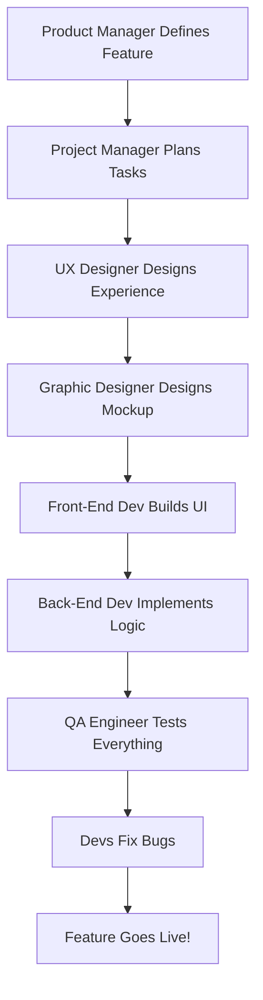

## 🧠 **Main Goal of This Guide**

To help you **understand the entire lifecycle** of a web development project — from tools and roles to team coordination and workflow methods. It’s the *"How it all comes together"* part of being a web developer.

---

## 🔧 1. **Typical Tech Stack (Tools Used in Web Projects)**

| Layer           | Examples                                     | Purpose                                    |
| --------------- | -------------------------------------------- | ------------------------------------------ |
| **Frontend**    | HTML, CSS, JavaScript, React, Tailwind, Sass | What users see                             |
| **Backend**     | Node.js, PHP, Python, Express, .NET          | Server logic, APIs                         |
| **Database**    | MySQL, PostgreSQL, MongoDB                   | Data storage                               |
| **Server**      | Apache, Netlify, Vercel                      | Delivering content                         |
| **Other Tools** | GitHub, Jest, Figma, Canva, Parcel, Miro     | Version control, testing, planning, design |

📌 **Example:**
A blog built with:

* React for UI
* Node.js + Express for backend
* MongoDB for storing posts
* GitHub for team collaboration
* Figma for designing the UI mockups

---

## 🧑‍💼 2. **Job Roles in a Web Team**

| Role                     | What They Do                                   |
| ------------------------ | ---------------------------------------------- |
| **Product Manager**      | Research market needs and define features      |
| **Project Manager**      | Plans and monitors the team’s tasks            |
| **UX Designer**          | Designs user journeys and wireframes           |
| **Graphic Designer**     | Creates visual elements (icons, color schemes) |
| **Front-End Developer**  | Builds UI using HTML, CSS, JS                  |
| **Back-End Developer**   | Handles logic, APIs, and database              |
| **Full-Stack Developer** | Does both frontend and backend                 |
| **QA Engineer**          | Tests and reports bugs                         |
| **Content Writer**       | Writes copy, documentation, blogs              |

🧪 **Example:**
If you're building an eCommerce site:

* UX Designer maps the shopping experience
* Graphic Designer designs buttons and banners
* Front-End Dev builds the cart interface
* Back-End Dev handles inventory and orders
* QA tests if payments work correctly

---

## 📆 3. **Project Workflow (Step-by-Step Process)**

🧩 **Each role connects** in a pipeline — like a relay race.

---

## 🔁 4. **Work Management Styles**

### 🏔️ Waterfall (Traditional)

* 🧱 Step-by-step phases (like a staircase)
* 🧍‍♂️ Less flexible
* ✅ Predictable but slow

### 💡 Agile (Modern)

* 🔁 Cycles with rapid improvements
* 🧑‍🤝‍🧑 Collaboration + Feedback
* 🚀 Fast, adaptive, continuous delivery

🛠️ **Agile Methods:**

* **Scrum**: Has sprints (2-week work cycles), a scrum master, daily meetings (stand-ups), and retrospectives
* **Kanban**: Uses boards (like Trello) to move tasks from *To Do → Doing → Done*

📌 **Example Agile Workflow (Scrum):**

1. Sprint planning
2. Daily stand-up meetings
3. Mid-sprint: testing and feedback
4. Sprint end: review + improvements
5. Next sprint starts

---

## 🧭 5. **What You Should Focus On Now**

You’re early in your journey — don’t panic about learning *everything* at once. Here's your **path**:

### ✅ Learn First:

* HTML, CSS, JavaScript
* Git + GitHub
* Figma basics (optional but helpful)

### 🔜 Learn Later:

* React or a JS framework
* Agile workflows (Trello, Scrum)
* Frontend deployment (Netlify/Vercel)
* Version control collaboration (branches, pull requests)

---

## 🎓 Summary Table

| Area                 | Learn Now ✅ | Learn Later 🔜 |
| -------------------- | ----------- | -------------- |
| HTML/CSS/JS          | ✅           |                |
| Git/GitHub           | ✅           |                |
| Figma, Canva         | ✅           |                |
| React or Vue         |             | ✅              |
| Node.js or Python    |             | ✅              |
| Agile, Scrum, Trello |             | ✅              |
| Jest Testing         |             | ✅              |
| DevOps, CI/CD        |             | 🚀 Advanced    |

---

If you'd like, I can turn this into:

* A **PDF visual guide**
* A **Notion board**
* A **Flashcard quiz** to test your understanding
  Just let me know your preferred format 💡

Would you also like a **real project example** showing how these roles/tools/processes come together in one web app?
